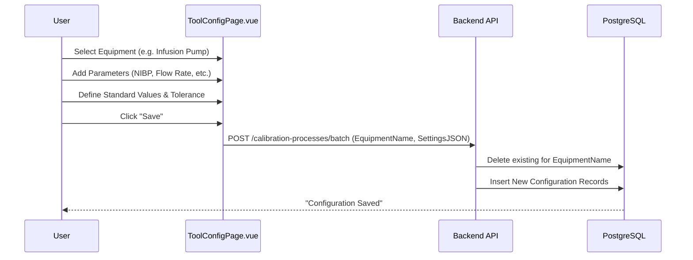
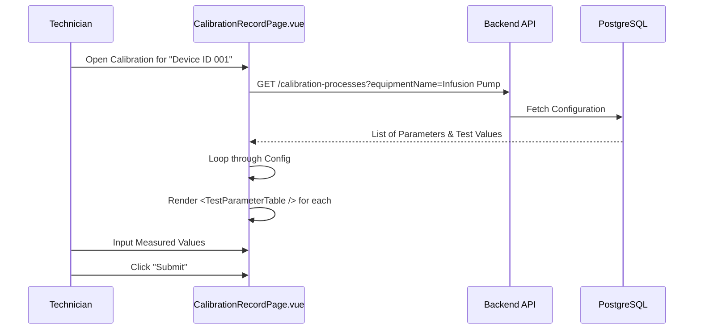

# Calibration Configuration & Dynamic Form Flow

This document describes the technical flow for saving calibration settings (Parameters, Standards, UCb, etc.) and dynamically displaying them on the Calibration Record page.

## ── 1. Configuration Phase (Setting Page)

The User defines how a specific piece of equipment (e.g., Infusion Pump) should be calibrated.

### Data Structure (Proposed)
We will extend the `calibration_processes` table to store all necessary metadata:
- `parameter_name`: e.g., "Systolic"
- `unit`: e.g., "mmHg"
- `tolerance`: e.g., "1.0"
- `test_values`: `[80, 120, 160]` (Stored as JSON)
- `ucb1, ucb2, ucb3`: (Configurable per parameter)

---

## ── 2. Execution Phase (Calibration Page)

When the technician starts working, the form is generated **dynamically** based on the saved settings.

## ── 3. Key Technical Changes Required

### Backend
1.  **Modify [CalibrationProcess](file:///Users/stitchy/Desktop/Stitchy/cal_backend/src/calibration-process/calibration-process.entity.ts#12-39) Entity**: Add fields for `tolerance`, `test_values` (JSON), `display_type`, `resolution`, `ucb1-3`.
2.  **Add Batch API**: An endpoint to save multiple parameters at once for a specific equipment name.

### Frontend
1.  **Update [ToolConfigPage.vue](file:///Users/stitchy/Desktop/Stitchy/cal_frontend/src/pages/ToolConfigPage.vue)**: Call the batch API to save the current state.
2.  **Create `DynamicCalibrationForm.vue`**: A component that takes the lists of parameters from the API and renders the appropriate number of `TestParameterTable` components.
3.  **Update [CalibrationRecordPage.vue](file:///Users/stitchy/Desktop/Stitchy/cal_frontend/src/pages/CalibrationRecordPage.vue)**: Replace hardcoded [TestPatientMonitor.vue](file:///Users/stitchy/Desktop/Stitchy/cal_frontend/src/components/calibration/forms/TestPatientMonitor.vue) or [TestInfusionPump.vue](file:///Users/stitchy/Desktop/Stitchy/cal_frontend/src/components/calibration/forms/TestInfusionPump.vue) with the dynamic form if a config exists.

> [!NOTE]
> This approach allows you to add new equipment types in the future without writing new Vue components. You just "Set it up" in the Settings page and the Recording page will work instantly.

---

**Do you approve of this flow? If so, I will proceed with the Backend changes (Database Schema) first.**
