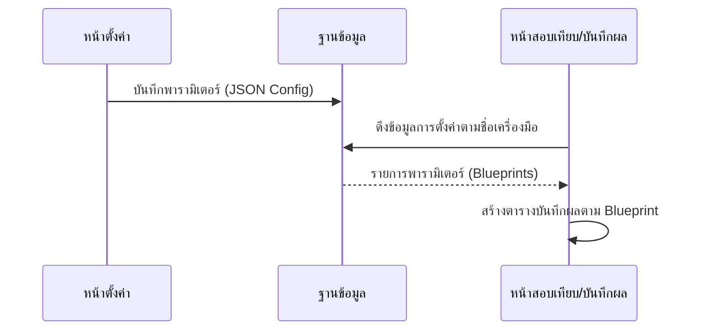

# MECMS: Workflow การสอบเทียบเครื่องมือวัด (Calibration Flow)

เอกสารนี้อธิบายขั้นตอนการทำงาน (Workflow) ของระบบ MECMS ตั้งแต่เริ่มการสอบเทียบ ตรวจสภาพภายนอก บันทึกผล ไปจนถึงการอนุมัติและออกใบรับรอง

## ลำดับขั้นตอนการทำงาน (Step-by-Step Logic)

1. **เริ่มงานสอบเทียบ:** ช่างเทคนิคกดเลือกเครื่องมือเพื่อเริ่มงาน
2. **ตรวจสอบสภาพภายนอก (External Inspection):**
   - **ไม่ผ่าน:** เปลี่ยนสถานะเครื่องเป็น `ส่งซ่อม` ทันที (ยุติกระบวนการสอบเทียบ)
   - **ผ่าน:** เปลี่ยนสถานะเครื่องเป็น `กำลังสอบเทียบ` และเข้าสู่ขั้นตอนการวัดค่า
3. **ดำเนินการสอบเทียบ (Calibration Process):** ช่างทำการวัดค่าและบันทึกผลลงระบบ
4. **ระบบประเมินผลและคำนวณรอบอัตโนมัติ:**
   - **กรณีสอบไม่ผ่าน:** ระบบเปลี่ยนสถานะเครื่องเป็น `ปิดใช้งาน` ทันที และส่งเรื่องรอหัวหน้าอนุมัติ
   - **กรณีสอบผ่าน:** ระบบจะ **คำนวณรอบสอบเทียบถัดไปให้อัตโนมัติ** (บวกเดือนเพิ่มตามที่ตั้งค่าไว้) และส่งเรื่องรอหัวหน้าอนุมัติ
5. **หัวหน้าพิจารณาอนุมัติ (Head Approval):**
   - **สอบผ่าน + ไม่อนุมัติ:** ตีกลับงาน เปลี่ยนสถานะกลับไปให้ช่าง `สอบเทียบใหม่`
   - **สอบผ่าน + อนุมัติ:** ระบบ **ออกใบ Certificate และสร้าง QR Code** พร้อมเปลี่ยนสถานะเครื่องเป็น `พร้อมใช้งาน`
   - **สอบไม่ผ่าน + อนุมัติ:** ยืนยันสถานะ `ปิดใช้งาน` ตามเดิม

---

## 6. โครงสร้างการตั้งค่าชุดทดสอบแบบ Dynamic (Technical Flow)

ระบบรองรับการตั้งค่าพารามิเตอร์แบบยืดหยุ่น โดยไม่ต้องเขียนโค้ดเพิ่มสำหรับเครื่องมือใหม่

### 6.1 การตั้งค่าพารามิเตอร์ (ขั้นตอนการตั้งค่า)
- **หน้าจอ:** `ToolConfigPage.vue`
- **การทำงาน:** บันทึกโครงสร้างการสอบเทียบลงใน `calibration_processes` (เก็บ Parameter, Unit, Tolerance, Test Values, UCb) เพื่อเป็นเทมเพลต

### 6.2 การสร้างฟอร์มบันทึกผลอัตโนมัติ (ขั้นตอนการสอบเทียบ)
- **หน้าจอ:** `CalibrationRecordPage.vue` จะดึงค่าการตั้งค่าจาก DB ตามชนิดของเครื่องมือ
- **ฟอร์ม Dynamic:** ระบบจะวนลูปสร้างตาราง `TestParameterTable` ตามจำนวนและรายละเอียดที่ตั้งค่าไว้ในขั้นตอนที่ 6.1 โดยอัตโนมัติ

